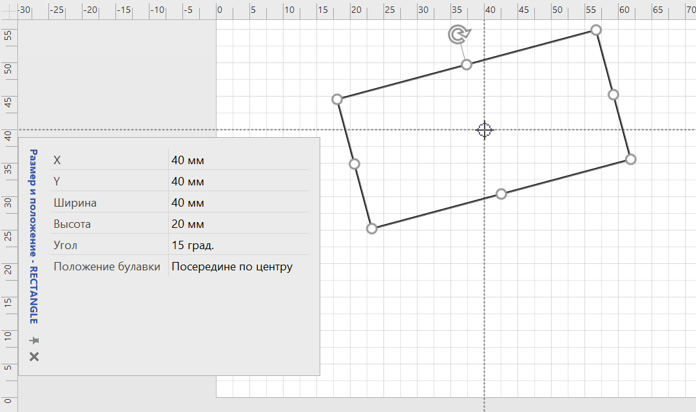
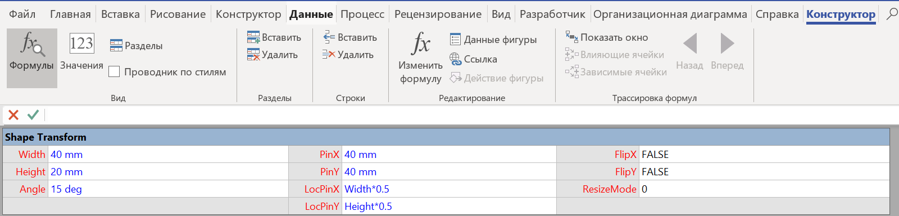

# Как изменить координаты фигуры программно

### Особенности системы координат

Для начала поговорим о том, как в MS Visio описываются координаты фигуры.

С помощью пользовательского интерфейса геометрические параметры фигуры можно изменять используя окно **«**[**Размер и положение**](https://rus-visio-blog-archive.github.io/2017/06/08/razmery-figur-ili-kak-vmestit-rakovinu-v-malenkuju-vannuju-komnatu.htm)**»**.



По умолчанию, точкой отсчета координат страницы является ее левый нижний угол. Местоположение фигуры на странице определяется параметрами **X**, **Y** и **«Положение булавки»** \(**Pin Position**\).


По умолчанию **«Положение булавки»** располагается в геометрическом центре фигуры \(В середине по центру\). С помощью выпадающего списка в окне **«Размер и положение»** можно изменять **«Положение булавки»**.


В [таблице свойств фигуры \(ShapeSheet\)](https://rus-visio-blog-archive.github.io/2018/05/21/shapesheet-intro.htm) параметры определяющие размеры и расположение фигуры содержатся в разделе [**Shape Transform**](https://shapesheet-kb.github.io/ru/pages/sections/%D0%A0%D0%B0%D0%B7%D0%B4%D0%B5%D0%BB%20Shape%20Transform.htm).



Параметрам **X**/**Y** в окне **«Размер и положение»** соответствуют параметры содержащиеся в ячейках **PinX**/**PinY** таблицы свойств. А параметр **«Положение булавки»** соответствует комбинации параметров **LocPinX** и **LocPinY**.

### Как программно изменять размеры, ориентацию и местоположение фигуры

В Visio вся информация о параметрах объекта хранится в ячейках таблицы свойств. Существует два способа обращения к ячейкам:

* с указанием непосредственно имени ячейки \([**Cells**](https://docs.microsoft.com/en-us/office/vba/api/visio.shape.cells)\)

  **Синтаксис**

  _выражение_.`Cells`\(`"Имя ячейки"`\)

  _выражение_ Переменная, представляющая объект [Shape](https://docs.microsoft.com/en-us/office/vba/api/visio.shape) .

  **Параметры**

  | Имя | Обязательный или необязательный | Тип данных | Описание |
  | :--- | :--- | :--- | :--- |
  | _Имя ячейки_ | Обязательный | **Строка** | Имя ячейки таблицы свойств фигуры. |

* с указанием индексов раздела, строки раздела и столбца в строке \([**CellsSRC**](https://docs.microsoft.com/en-us/office/vba/api/visio.shape.cellssrc) - **S**ection \(Раздел\), **R**ow \(Строка\), **C**olumn \(Столбец\)\).

  **Синтаксис**

  _выражение_. `CellsSRC`\( `Section` , `Row` , `Column` \)

  _выражение_ Переменная, представляющая объект [Shape](https://docs.microsoft.com/en-us/office/vba/api/visio.shape) .

  **Параметры**

  | Имя | Обязательный или необязательный | Тип данных | Описание |
  | :--- | :--- | :--- | :--- |
  | _Section_ | Обязательный | **Integer** | Индекс раздела ячейки. |
  | _Row_ | Обязательный | **Integer** | Индекс строки в ячейке. |
  | _Column_ | Обязательный | **Integer** | Индекс столбца ячейки. |


Некоторые языки программирования \(например [C\#](https://ru.wikipedia.org/wiki/C_Sharp)\) поддерживают обращение к ячейкам только с использованием **CellsSRC**!


Разделу **Shape Transform** таблицы свойств соответствует одна из строк в разделе **visSectionObject**.

При программировании в среде VBA в приложении Visio, в другом приложении с использованием [раннего связывания](https://docs.microsoft.com/ru-ru/dotnet/visual-basic/programming-guide/language-features/early-late-binding/) можно использовать специальные константы Visio из [перечисления стандартных констант Visio](https://docs.microsoft.com/en-us/office/vba/api/visio%28enumerations%29). При использовании позднего связывания или языка программирования [Visual Basic Script](https://ru.wikipedia.org/wiki/VBScript) необходимо использовать числовые индексы соответствующие [разделу](https://docs.microsoft.com/en-us/office/vba/api/visio.vissectionindices), [строкам](https://docs.microsoft.com/en-us/office/vba/api/visio.visrowindices) и [столбцам](https://docs.microsoft.com/en-us/office/vba/api/visio.viscellindices).  

В нижеследующей таблице приведены названия констант, соответствующие значения и описания для строки и столбцов ячеек относящихся к разделу Shape Transform таблицы свойств.

| Константа | Значение | Описание |
| :--- | :--- | :--- |
| visSectionObject | 1 | Содержит общие неповторяющихся свойства объекта. |
| visRowXFormOut | 1 | Индекс строки в разделе visSectionObject , который содержится информация о разделе Shape Transform \(параметры размеров и местоположения фигуры\). |
| visXFormWidth | 2 | Ячейка Width \(раздел "Shape Transform"\) |
| visXFormHeight | 3 | Ячейка Height \(раздел "Shape Transform"\) |
| visXFormAngle | 6 | Ячейка Angle \(раздел "Shape Transform"\) |
| visXFormPinX | 0 | Ячейка PinX \(раздел "Shape Transform"\) |
| visXFormPinY | 1 | Ячейка PinY \(раздел "Shape Transform"\) |
| visXFormLocPinX | 4 | Ячейка LocPinX \(раздел "Shape Transform"\) |
| visXFormLocPinY | 5 | Ячейка LocPinY \(раздел "Shape Transform"\) |
| visXFormFlipX | 7 | Ячейка FlipX \(раздел "Shape Transform"\) |
| visXFormFlipY | 8 | Ячейка FlipY \(раздел "Shape Transform"\) |
| visXFormResizeMode | 9 | Ячейка ResizeMode \(раздел "Shape Transform"\) |

### \*\*\*\*

### **Примеры**

```text
Sub ShapeTransform_Cells()
Dim sh As Shape 
Set sh = ActiveWindow.Selection.PrimaryItem
sh.Cells("Width").FormulaU = "50 mm"
sh.Cells("Height").FormulaU = "30 mm"
sh.Cells("Angle").FormulaU = "33 deg"
sh.Cells("PinX").FormulaU = "60 mm"
sh.Cells("PinY").FormulaU = "60 mm"
sh.Cells("LocPinX").FormulaU = "Width*0"
sh.Cells("LocPinY").FormulaU = "Height*1"
sh.Cells("FlipX").FormulaU = "True"
sh.Cells("FlipY").FormulaU = "True"
sh.Cells("ResizeMode").FormulaU = "1"
End Sub 
  
Sub ShapeTransform_CellsSRC()
Dim sh As Shape
Set sh = ActiveWindow.Selection.PrimaryItem
sh.CellsSRC(visSectionObject, visRowXFormOut, visXFormWidth).FormulaU = "50 mm"
sh.CellsSRC(visSectionObject, visRowXFormOut, visXFormHeight).FormulaU = "50 mm"
sh.CellsSRC(visSectionObject, visRowXFormOut, visXFormAngle).FormulaU = "16 deg"
sh.CellsSRC(visSectionObject, visRowXFormOut, visXFormPinX).FormulaU = "50 mm"
sh.CellsSRC(visSectionObject, visRowXFormOut, visXFormPinY).FormulaU = "55 mm"
sh.CellsSRC(visSectionObject, visRowXFormOut, visXFormPinX).FormulaU = "Width*0.5"
sh.CellsSRC(visSectionObject, visRowXFormOut, visXFormPinY).FormulaU = "Height*0.5"
sh.CellsSRC(visSectionObject, visRowXFormOut, visXFormFlipX).FormulaU = "FALSE"
sh.CellsSRC(visSectionObject, visRowXFormOut, visXFormFlipY).FormulaU = "FALSE"
sh.CellsSRC(visSectionObject, visRowXFormOut, visXFormResizeMode).FormulaU = "FALSE"
End Sub
```

